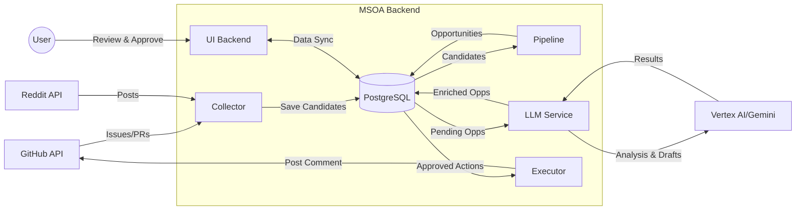

# System Flow Diagram (Simplified)

This diagram provides a high-level overview of the MSOA (Marketing Bot) system architecture and data flow.

## Core Workflow

1.  **Harvest**: Collector periodically pulls potential leads from GitHub and Reddit.
2.  **Filter**: Pipeline refines candidates by checking Author/Repo cooldowns.
3.  **Analyze**: LLM Service qualifies leads (Signal & Risk) and drafts responses.
4.  **Decide**: User reviews analysis and approves responses via Dashboard.
5.  **Act**: Executor posts the approved response back to GitHub.
