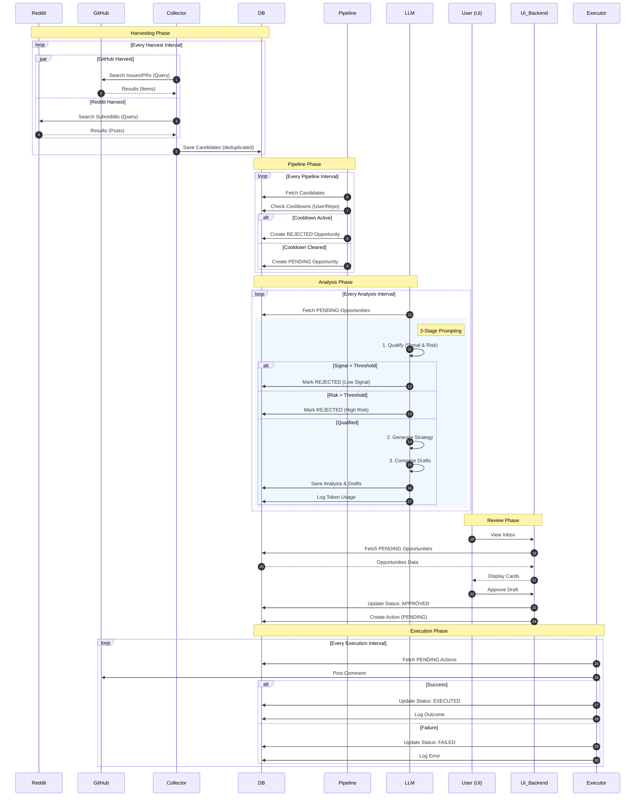

# System Sequence Diagram

This sequence diagram details the lifecyle of an opportunity from detection (harvesting) to action execution.

```mermaid
sequenceDiagram
    autonumber
    participant Reddit
    participant GitHub
    participant Collector
    participant DB
    participant Pipeline
    participant LLM
    participant UI_User as User (UI)
    participant UI_Backend
    participant Executor

    %% Harvesting Phase
    Note over Reddit, DB: Harvesting Phase
    loop Every Harvest Interval
        par GitHub Harvest
            Collector->>GitHub: Search Issues/PRs (Query)
            GitHub-->>Collector: Results (Items)
        and Reddit Harvest
            Collector->>Reddit: Search Subreddits (Query)
            Reddit-->>Collector: Results (Posts)
        end
        Collector->>DB: Save Candidates (deduplicated)
    end

    %% Pipeline Phase
    Note over DB, Pipeline: Pipeline Phase
    loop Every Pipeline Interval
        Pipeline->>DB: Fetch Candidates
        Pipeline->>DB: Check Cooldowns (User/Repo)
        alt Cooldown Active
            Pipeline->>DB: Create REJECTED Opportunity
        else Cooldown Cleared
            Pipeline->>DB: Create PENDING Opportunity
        end
    end

    %% Analysis Phase
    %% Analysis Phase
    Note over DB, LLM: Analysis Phase
    loop Every Analysis Interval
        LLM->>DB: Fetch PENDING Opportunities
        
        rect rgb(240, 248, 255)
            Note right of LLM: 3-Stage Prompting
            LLM->>LLM: 1. Qualify (Signal & Risk)
            
            alt Signal < Threshold
                LLM->>DB: Mark REJECTED (Low Signal)
            else Risk > Threshold
                LLM->>DB: Mark REJECTED (High Risk)
            else Qualified
                LLM->>LLM: 2. Generate Strategy
                LLM->>LLM: 3. Compose Drafts
                LLM->>DB: Save Analysis & Drafts
                LLM->>DB: Log Token Usage
            end
        end
    end

    %% Review Phase
    Note over UI_User, UI_Backend: Review Phase
    UI_User->>UI_Backend: View Inbox
    UI_Backend->>DB: Fetch PENDING Opportunities
    DB-->>UI_Backend: Opportunities Data
    UI_Backend-->>UI_User: Display Cards

    UI_User->>UI_Backend: Approve Draft
    UI_Backend->>DB: Update Status: APPROVED
    UI_Backend->>DB: Create Action (PENDING)
    
    %% Execution Phase
    Note over DB, Executor: Execution Phase
    loop Every Execution Interval
        Executor->>DB: Fetch PENDING Actions
        Executor->>GitHub: Post Comment
        alt Success
            Executor->>DB: Update Status: EXECUTED
            Executor->>DB: Log Outcome
        else Failure
            Executor->>DB: Update Status: FAILED
            Executor->>DB: Log Error
        end
    end
```
